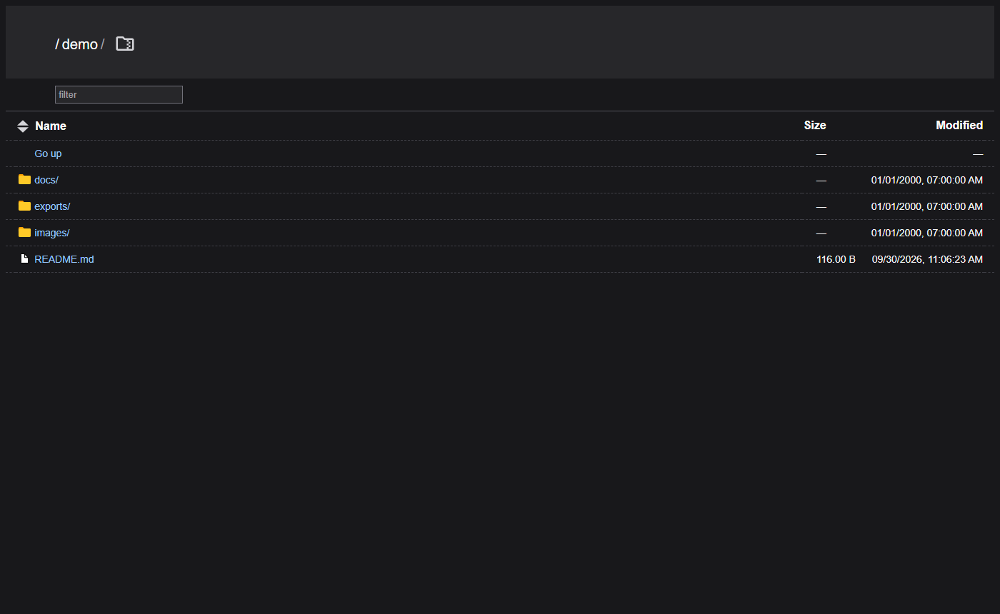
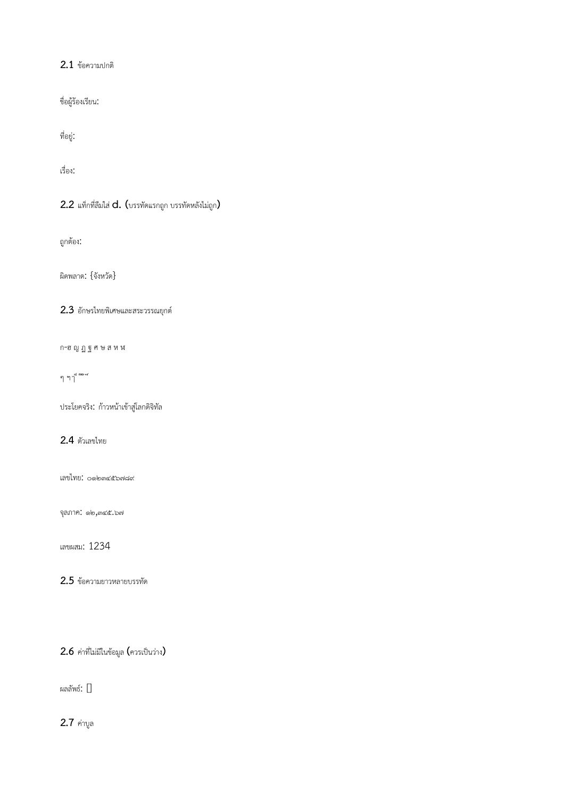

# Dokploy Infra

**ทั้งระบบรวม stack เดียว** — ตั้งแต่ 2026-10-05 ที่รวมตัวแอป 2docx.com เข้ามาด้วย
เดิมแยกเป็นสอง project (`dokploy-infra` + `docgen`) ทำให้ Dokploy ต้อง deploy สอง app
และ `depends_on` ข้าม project ใช้ไม่ได้ (api/worker เคย crash วนตอน boot)

| Service | ทำอะไร | RAM | Port (internal) |
|---|---|---|---|
| `mongo-1/2/3` | Database — replica set 3 node | ~430 MB | 27017 |
| `nats` | Queue / background jobs (JetStream — มี ack, redelivery, replay) | ~7 MB | 4222, 8222, ws:8080 |
| `valkey` | Cache (evict ได้ ไม่เสียหาย) | ~4 MB | 6379 |
| `rustfs` | Object storage แบบ S3 (แทน MinIO) | ~101 MB | 9000, 9001 |
| `rustfs-ui` | หน้าเว็บดูไฟล์ (rclone) | ~17 MB | `127.0.0.1:8080` |
| `docserver` | เอกสารราชการไทย (Carbone 5.15.2 + ฟอนต์ SIPA) | ~180 MB | **ไม่มีพอร์ต** — เข้าผ่านชื่อ `docserver` ในเครือข่ายเท่านั้น |
| `loki` | เก็บ log ทุก container | ~50 MB | `127.0.0.1:3100` |
| `alloy` | ส่ง log เข้า Loki | ~80 MB | `127.0.0.1:12345` |
| **`docgen-api`** | API (Fastify 5 + Zod 4) | ~200 MB | 4000 |
| **`docgen-worker`** | ดึงงานจาก NATS → เรนเดอร์ → เก็บ S3 | ~150 MB | — |
| **`docgen-web`** | เว็บ Next.js | ~150 MB | 3000 |
| **`docgen-gateway`** | **ทางเข้าเดียว** (Caddy) | ~30 MB | `127.0.0.1:8090` |
| `mongo-init` | initiate replica set + สร้าง user — รันครั้งเดียวแล้วจบ | — | — |
| `cloudflared` | Cloudflare Tunnel — *ยังไม่ได้เปิด (profile `tunnel`)* | — | — |

> โค้ดตัวแอปยังอยู่ที่ `../docgen-platform` — `build.context` ในไฟล์ compose ชี้ไปที่นั่น
> เอกสารของตัวแอปอยู่ที่ `../docgen-platform/README.md`

ทั้งหมดอยู่บน Docker network ชื่อ `infra` ซึ่งประกาศเป็น `external: true`
เพื่อให้ `docker compose down` ไม่ลบ network ทิ้ง (ถ้าเป็น network ปกติ มันจะถูกลบพร้อมกัน)

---

## เริ่มใช้งาน

```bash
docker network create infra        # ต้องทำก่อน — compose ประกาศเป็น external
cp .env.example .env               # เติมค่าจริง (ค่ากลางของทั้งระบบอยู่ไฟล์นี้ไฟล์เดียว)
docker compose up -d
docker compose ps
```

| คำสั่ง | ผล |
|---|---|
| `docker compose up -d` | ขึ้นทั้งระบบ 14 container (infra 10 + ตัวแอป 4) |
| `docker compose --profile tunnel up -d` | ขึ้นเพิ่ม cloudflared (ต้องใส่ token ก่อน) |
| `docker compose down` | ปิดทั้งหมด **เก็บข้อมูลไว้** |
| `docker compose down -v` | ลบ volume ด้วย — **ระวัง ข้อมูลหาย** |
| `docker compose -f docker-compose.yml -f docker-compose.dev-ports.yml up -d` | debug — publish `127.0.0.1:4001` (api) และ `127.0.0.1:3000` (web) |

> ⚠️ **build context ชี้ไป `../docgen-platform`** — Docker อ่าน path สัมพัทธ์จาก
> โฟลเดอร์ที่ไฟล์ compose อยู่ ไม่ใช่จาก cwd → สั่งจากที่ไหนก็ได้ผลเหมือนกัน
> ถ้าย้ายโค้ดไปที่อื่น ต้องแก้ `context:` ทั้ง 3 จุด

### ตัวแอปต้องใช้ค่าจาก `.env` ที่นี่เท่านั้น

`docker compose` อ่านค่าไว้ในรูปแบบ `${VAR}` จาก `.env` **ที่อยู่โฟลเดอร์เดียวกับไฟล์ compose**
ย้ายไฟล์ compose ไปที่อื่น = ค่ากลางทั้งหมดกลายเป็นค่าว่าง และ `docgen-api` / `docgen-worker`
จะ crash ตอน boot (schema ไม่ผ่าน) โดยไม่มีที่ไหนบอกชัด

> ตอนย้ายจริง 2026-10-05 `docker compose config` เตือน `CASDOOR_*` และ `S3_*` ไม่ set
> ตอนนั้นยังไม่ได้ย้ายคีย์ → ต้องย้ายคีย์ของแอปมาไว้ในไฟล์นี้ก่อน

### ใส่ token เพื่อเปิด Tunnel

`.env` → `CF_TUNNEL_TOKEN` จาก **Zero Trust → Networks → Tunnels → tunnel ของคุณ → Configure**

### ตอน dev บน host ใช้ env สองไฟล์

โค้ดที่ `../docgen-platform` เมื่อรัน dev บน host ต้องการค่าที่**ต่างจาก container**
(ชี้ `127.0.0.1` แทนชื่อ service) จึงแยกไฟล์ไว้สองฝั่ง:

| ไฟล์ | มีอะไร | ใครอ่าน |
|---|---|---|
| `.env` (ที่นี่) | ค่ากลางทั้งหมด — secret, Casdoor, S3, NATS | `docker compose` + dev (อ่านก่อน) |
| `../docgen-platform/.env` | เฉพาะค่าที่ต่างตอน dev (URL ที่ชี้ `127.0.0.1`) | dev (อ่านทีหลัง = ทับ) |

dev อ่านสองไฟล์เรียงกัน และ**ไฟล์หลังทับไฟล์หน้า** (ยืนยันแล้วด้วยการทดสอบสลับลำดับ):

```
node --env-file=../../../dokploy-infra/.env --env-file=../../.env …
```

> ระวัง path: npm รัน script ของ workspace ที่ `apps/api` → ต้องขึ้น **3** ชั้น
> (`../../../dokploy-infra/.env`) ไม่ใช่ 2 ชั้น
> ใส่ผิดแล้ว Node จะพ่น `not found` แล้ว dev ไม่ขึ้น — จริงแล้วเจอตอนทำจริง

---

## 4. Document server — Carbone + ฟอนต์ราชการไทย

สร้างจากโปรเจกต์ `2docx.com` (`tests/Dockerfile`):
`FROM carbone/carbone-ee:full-5.15.2` + ฟอนต์ SIPA/กรมทรัพย์สิทย์ฯ + LibreOffice 26.2

```bash
# เช็คว่าพร้อม — ต้องรันจาก container ที่อยู่บน network `infra` เท่านั้น
# เพราะ docserver ไม่มีพอร์ตผูกไว้แล้ว (2026-10-05)
docker exec docgen-worker-1 wget -qO- http://docserver:4000/status
# {"success":true,"code":200,"message":"OK","version":"5.15.2"}
```

### ⚠️ 4 โฟลเดอร์ที่ต้อง persist

**ก่อนย้ายเข้า stack นี้ container เดิมไม่มี volume เลย** — แม่แบบที่อัปโหลดไว้ 11 ไฟล์
กับ `metadata.db` อยู่ใน writable layer ล้วน ๆ ถ้า container ถูก recreate ทุกอย่างหาย

ตอนนี้ mount ไว้แล้ว:

| โฟลเดอร์ | เก็บอะไร |
|---|---|
| `/app/template` | แม่แบบ .docx ที่อัปโหลดผ่าน studio |
| `/app/database` | `metadata.db` (SQLite) — metadata ของแม่แบบ |
| `/app/render` | PDF ที่เรนเดอร์เสร็จแล้ว |
| `/app/queue` | คิวงานภายใน |

> **อย่า mount `/app/config`** — ไฟล์นี้ถูก `COPY` เข้าไปตอน build image
> ถ้าทับจะเสียค่าที่ตั้งไว้ (`factories: 3`, `converterFactoryTimeout: 300000`)
> แล้วเอกสารยาวจะหมดเวลา

### ⚠️ API ไม่มี authentication

`config.json` ตั้ง `"authentication": false` → **ทุกคนที่ยิงถึง docserver เรียก render ได้**

ไม่มีทางเข้าจากภายนอกเลย (แก้ 2026-10-05 ทั้ง 3 ชั้น):

| ชั้น | เดิม | ตอนนี้ |
|---|---|---|
| พอร์ตบน host | `0.0.0.0:4000` → `127.0.0.1:4000` | **ไม่มีพอร์ตเลย** |
| หน้าเว็บ Carbone Studio | เปิดที่ `/` | **ปิด** (`CARBONE_STUDIO=false`) |
| เครือข่าย | `172.19.0.0/16` | เหมือนเดิม — host เข้าไม่ถึง (WSL2) |

เหลือทางเดียวคืออยู่ในเครือข่าย Docker (`docserver:4000`) ซึ่งมีแต่ container
ถ้าจะเข้าจากเครื่องอื่นต้องใช้ SSH tunnel + Cloudflare Access

### ใช้งาน (ต้องรันจากในเครือข่าย `infra`)

docserver ไม่มีพอร์ตผูกไว้ → host ยิงตรงไม่ได้ (Docker Desktop ใช้ WSL2
ซึ่งแยก network namespace) ต้องรันคำสั่งจาก container ที่อยู่ในเครือข่ายเดียวกัน

```bash
# สร้างเอกสาร — Carbone 5 เป็น async: คืน renderId ก่อน
docker exec docgen-worker-1 wget -qO- \
  --header='Authorization: Bearer carbon-ce' \
  --header='carbone-version: 5' \
  --post-data='{"data":{}}' \
  "http://docserver:4000/render/{templateId}"
# {"success":true,"data":{"renderId":"xxxxx.pdf"}}

# ค่อยดึงไฟล์จริง
docker exec docgen-worker-1 wget -qO- \
  --header='Authorization: Bearer carbon-ce' \
  "http://docserver:4000/render/{renderId}" > ผลลัพธ์.pdf
```

> ต้องดึง 2 รอบ — รอบแรกได้ renderId รอบสองเอาไฟล์จริง
> ถ้าทำรอบเดียวจะได้ JSON 73 bytes ไม่ใช่ PDF
>
> อัปโหลดแม่แบบต้องเป็น `multipart/form-data` และ field `versioning`
> ต้องมา**ก่อน** field ไฟล์ ไม่งั้นได้ 400 (code w131)
> ดูวิธีที่ API เราใช้จริงที่ `docgen-platform/apps/api/src/modules/templates/carbone.ts`

### สร้าง image ใหม่หลังแก้ Dockerfile

```bash
cd D:\2docx.com\tests
powershell -NoProfile -ExecutionPolicy Bypass -File .\build.ps1
powershell -NoProfile -ExecutionPolicy Bypass -File .\push.ps1
docker compose pull docserver && docker compose up -d docserver
```

---

## Cloudflare Tunnel + Access

| Hostname | Service | โปรโตคอล |
|---|---|---|
| `nats.yourdomain.com` | `tcp://nats:4222` | TCP |
| `cache.yourdomain.com` | `tcp://valkey:6379` | TCP |
| `storage.yourdomain.com` | `http://rustfs-ui:8080` | HTTP |
| `s3.yourdomain.com` | `http://rustfs:9000` | HTTP |

> 🚫 **ไม่ต้อง (และไม่ควร) ผูก `docserver` เข้า tunnel เด็ดขาด**
> `docserver` ตั้ง `"authentication": false` และ REST API ไม่มี auth
> ถ้าผูกไว้ ใครก็เรียกเรนเดอร์เอกสารได้โดยไม่ต้องล็อกอิน
> หน้าเว็บ Carbone Studio ปิดไปแล้ว (`CARBONE_STUDIO=false`, 2026-10-05)
> แต่ REST API ยังเปิดอยู่ — ถ้าจำเป็นต้องเข้าจากเครื่องอื่นจริง ๆ
> ให้ใช้ SSH tunnel แทน (`ssh -L 4000:docserver:4000 …`) ซึ่งไม่เปิดออกสู่ภายนอก

**ต้องสร้าง Access Application ครบทุก hostname** — ไม่งั้น tunnel จะเปิดให้ใครก็ได้ต่อ

> NATS และ Valkey เป็น TCP → ฝั่ง client ต้องรัน `cloudflared access tcp`
> ที่เหลือเป็น HTTP → ตั้งใน Dokploy tab ได้เลย

---

## 1. Queue — NATS + JetStream

**แก้ตัวนี้ถ้าเปลี่ยน subject**

```bash
# สร้าง stream
docker run --rm --network infra -v "$PWD:/work" -w /work natsio/nats-box:latest \
  nats --server nats://nats:4222 --user app --password '<NATS_PASSWORD>' \
  stream add JOBS --subjects "jobs.>" --retention limits --storage file \
  --replicas 1 --discard old --max-msgs 1000000 --max-age 24h \
  --dupe-window 2m --defaults
```

- `retention limits` = work queue (เก็บจนกว่าจะ consume / ชนลิmit)
  ถ้าต้องการ event log ที่ replay ได้ ใช้ `interest` แทน
- `--dupe-window 2m` = กันข้อความซ้ำภายใน 2 นาที

**Work queue** — `nats consumer add` ต้องมี TTY จึง prompt เอา deliver subject
รันใน script/CI ไม่ได้ → ใช้ `worker-consumer.json` แทน

```bash
docker run --rm --network infra -v "$PWD:/work" -w /work natsio/nats-box:latest \
  nats --server nats://nats:4222 --user app --password '<NATS_PASSWORD>' \
  consumer add JOBS --config worker-consumer.json
```

> ไฟล์ JSON ต้องเป็น **UTF-8 ไม่มี BOM** (PowerShell 5.1 `Set-Content -Encoding UTF8` จะเขียน BOM)
> ในงานจริง consumer มักถูกสร้างอัตโนมัติตอน worker app เชื่อมต่อ

ต่อจากแอป:

```env
NATS_URL=nats://app:<NATS_PASSWORD>@nats:4222
```

**NATS เปิด WebSocket ที่ port 8080 อยู่แล้ว** — client ที่เป็น browser ต่อได้เลย
ไม่ต้องเขียน Worker bridge เอง

> ⚠️ อย่าจับคู่ `allkeys-lru` กับ stream data — cache จะไป evict ข้อความที่ยังไม่ consume ทิ้ง

---

## 2. Cache — Valkey

ตั้งค่าใน `valkey/valkey.conf` แล้ว:

```
maxmemory 512mb
maxmemory-policy allkeys-lru
save ""
appendonly no
```

- persistence ปิดหมด — cache สร้างใหม่จาก DB ได้เสมอ และ RDB/AOF จะทำให้ fork กิน RAM เปล่า ๆ
- `allkeys-lru` ปลอดภัยเพราะ instance นี้ไม่ถือข้อมูลที่ห้ามหาย
- password ส่งผ่าน `--requirepass` ใน compose (valkey.conf ไม่รองรับ env substitution)

ต่อจากแอป:

```env
VALKEY_URL=redis://:<VALKEY_PASSWORD>@valkey:6379
```

> ใช้ `valkeys://` ถ้าเปิด TLS — ตอนนี้ยังไม่ได้เปิด ใช้ `redis://` ไปก่อน

---

## 3. Object storage — RustFS

> **ทำไมเปลี่ยน:** MinIO Community Edition ถูก archive **25 เม.ย. 2026**
> (`minio/minio` README เขียนว่า "THIS REPOSITORY IS NO LONGER MAINTAINED") และ `minio/mc` ถูก archive 14 ก.ค. 2026
> ไทม์ไลน์: พ.ค. 2025 ถอด console ออก → ต.ค. 2025 หยุดแจก image → ธ.ค. 2025 maintenance mode → เม.ย. 2026 archive
> เหลือแต่ AIStor ที่ปิด source ราคาเริ่ม ~$24,000/ปี

Apache 2.0 · เวอร์ชัน `1.0.0` (16 ก.ย. 2026) — **pin ไว้ใน compose แล้ว อย่าใช้ `latest`**

ต่อจากแอป:

```env
S3_ENDPOINT=http://rustfs:9000
S3_ACCESS_KEY=<STORAGE_ACCESS_KEY>
S3_SECRET_KEY=<STORAGE_SECRET_KEY>
S3_FORCE_PATH_STYLE=true      # ← จำเป็น
```

> ⚠️ ถ้าไม่ตั้ง `RUSTFS_SERVER_DOMAINS` จะรองรับ **path-style เท่านั้น**
> AWS SDK / Terraform หลายตัว default เป็น virtual-hosted-style → ต้องบังคับ `force_path_style`

### หน้าเว็บดูไฟล์

เปิด `http://127.0.0.1:8080/` → เห็น bucket → เข้าไปดู/ดาวน์โหลดได้

<เริ่มต้นผูกแค่ `127.0.0.1` เพราะ **UI นี้ไม่มี auth** เข้าจาก internet ไม่ได้
ถ้าจะเปิดผ่าน tunnel ให้พึ่ง Access Application คุมชั้นนอก>

**ข้อจำกัด:** อ่านอย่างเดียว ไม่มีปุ่มอัปโหลด

> console ของ RustFS ใช้ไม่ได้ — ทดสอบ 3 เวอร์ชัน (`1.0.1-preview.11`, `1.0.0`, `latest`)
> port 9001 listen จริงแต่ตอบเป็น `AccessDenied` XML ไม่ใช่หน้าเว็บ
> ลองครบแล้ว: เปลี่ยน access key, ส่ง `Host` header, ตาม redirect, ลอง `/console` `/ui` `/login`
>
> rclone v1.75.1 ใน Docker image **ไม่ได้ bundle Web GUI** → `rclone rcd` ได้ 404 ต้องใช้ `serve http`

### ใช้ rclone ด้วย

```bash
docker exec rustfs-ui rclone lsd s3rust:
docker exec rustfs-ui rclone lsf s3rust:demo/
```

### ตั้งเวลาไฟล์หมดอายุ

S3 ไม่มี "โฟลเดอร์" จริง — ใช้ **lifecycle rule + prefix**

```bash
cat > life.json <<'EOF'
{
  "Rules": [{
    "ID": "expire-temp",
    "Status": "Enabled",
    "Filter": { "Prefix": "temp/" },
    "Expiration": { "Days": 7 }
  }]
}
EOF

aws s3api put-bucket-lifecycle-configuration \
  --endpoint-url http://rustfs:9000 --bucket demo \
  --lifecycle-configuration file://life.json
```

**ข้อจำกัดสำคัญ:**

1. `Days` ต้องเป็นจำนวนเต็มบวก — `Days: 0` ถูกปฏิเสธ
2. ไม่มี API/CLI สั่ง scan เอง (RustFS CLI มีแค่ `server / info / tls / diagnose / inspect / connect`)
3. ตามมาตรฐาน S3 ลบตอนเที่ยงคืน UTC → rule 7 วัน = ถูกลบช่วงวันที่ 7–8 ไม่ใช่วันที่ 7 เป๊ะ
4. ทดสอบรอสั้น ๆ พิสูจน์ไม่ได้

**ถ้าต้องการหมดอายุแน่นอน** → presigned URL (ทดสอบแล้วใช้ได้)

```bash
aws s3 presign s3://demo/private/report.pdf --endpoint-url http://rustfs:9000 --expires-in 3600
```

**ถ้าต้องการลบอัตโนมัติทุกวัน** → cron + rclone คุมได้แน่นอนกว่า

```bash
rclone delete s3rust:demo/temp --min-age 7d --dry-run   # ลองก่อนเสมอ
```

```yaml
# crontab — เช้าวันจันทร์
0 3 * * 1 docker exec rustfs-ui rclone delete s3rust:demo/temp --min-age 7d
```

---

## ต่อแอปใน Dokploy เข้า network

**Compose → Advanced → Networks** เพิ่ม external network ชื่อ `infra`

```yaml
services:
  myapp:
    networks: [infra]

networks:
  infra:
    external: true
```

---

## กับดักที่เจอระหว่างทดสอบ

| อาการ | สาเหตุ |
|---|---|
| `variable reference for 'NATS_PASSWORD' ... can not be found` | `.env` ไม่ถูกโหลด หรือใส่ quote ครอบ `$NATS_PASSWORD` ใน `nats.conf` |
| `Unknown field "jetstream" parsing permissions` | ไม่มีฟิลด์นี้ — ต้อง allow `$JS.API.>` แทน |
| `exec: "nats": executable file not found` | image server ไม่มี CLI → ใช้ `natsio/nats-box` |
| `exec: line 8: illegal option --` | nats-box ต้องขึ้นต้นด้วยคำสั่ง `nats` ไม่ใช่ `--flag` |
| `could not request delivery target` | `nats consumer add` ต้องมี TTY → ใช้ `--config worker-consumer.json` |
| `invalid character 'ï' looking for beginning of value` | JSON มี BOM (PowerShell 5.1) |
| port เปิดแต่เข้าจาก host ไม่ได้ | default bind เป็น `[::]` (IPv6 อย่างเดียว) → ต้อง `--addr 0.0.0.0:8080` |
| เพิ่งสร้าง bucket แล้วเปิดดูไม่เห็น (404) | **rclone cache รายการไดเรกทอรี** → `docker compose restart rustfs-ui` |
| YAML `mapping values are not allowed` | `command:` มี `s3rust:` → ต้อง quote ไว้ |
| console ตอบเป็น S3 error | ข้อจำกัดของ RustFS ดูหัวข้อข้างบน |
| `Permissions Violation for Publish to "..."` | subject นอก allowlist — เพิ่มใน `nats.conf` |
| `NOAUTH` จาก Valkey | ไม่ได้ส่ง password หรือ password ไม่ตรง |
| `normal clients only allowed` | client ยังไม่ได้ auth |
| `cloudflared` ต่อ service ไม่ได้ | ต้องอยู่ network `infra` เดียวกัน |

---

## สิ่งที่ทดสอบผ่านแล้ว

ทดสอบจริงบน Docker 29.8 / Compose 5.5:

- ✅ `docker compose config` ผ่าน, env substitution ทำงาน
- ✅ NATS startup ปกติ, JetStream เปิด, WebSocket ฟังที่ `ws://0.0.0.0:8080`
- ✅ password ผิด → `Authorization Violation` · subject นอก allowlist → `Permissions Violation`
- ✅ สร้าง stream + durable pull consumer, publish → consume → ack ได้ payload จริง
- ✅ Valkey `PING` / `SET` / `GET`, policy `allkeys-lru`, `appendonly no`
- ✅ RustFS: `make_bucket` / `cp` / `ls` / `presign` / `put-bucket-lifecycle-configuration`
- ✅ auth ผิด → `InvalidAccessKeyId`
- ✅ rclone UI: HTTP 200 + HTML จริง เห็นรายการใน bucket ได้
- ✅ ข้อมูลรอดผ่านการ recreate container (volume `rustfs-data`, `nats-data`)
- ✅ docserver: `/status` → 200 version 5.15.2 · ฟอนต์ TH Sarabun ครบ 16 ตัว
- ✅ docserver: คืนแม่แบบ 11 ไฟล์ + `metadata.db` เข้า volume แล้ว
- ✅ docserver: เรนเดอร์ PDF ได้จริง 101 KB (`%PDF-`) ข้อความไทย + merge + loop ถูกต้อง




